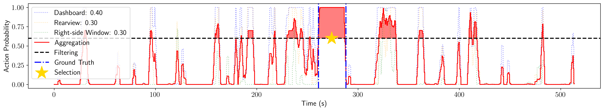
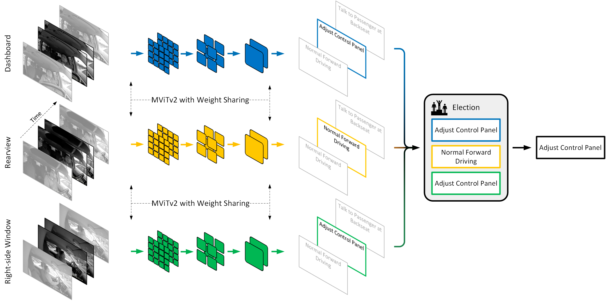

## M<sup>2</sup>DAR: : Multi-View Multi-Scale Driver Action Recognition with Vision Transformer

Yunsheng Ma,
Liangqi Yuan,
Amr Abdelraouf,
Kyungtae Han,
Rohit Gupta,
Zihao Li,
Ziran Wang



Introduction
Ensuring traffic safety and preventing accidents is a critical goal in daily driving. Computer vision technologies can
be leveraged to achieve this goal by detecting distracted driving behaviors. In this paper, we present a multi-view,
multi-scale framework for naturalistic driving action recognition and localization in untrimmed videos, namely
M<sup>2</sup>DAR.

## Methodology


M<sup>2</sup>DAR is a weight-sharing, Multi-Scale Transformer-based action recognition network that learns robust
hierarchical representations. It features a novel election algorithm consisting of aggregation, filtering, merging, and
selection processes to refine the preliminary results from the action recognition module across multiple views.

## Installation

This project is based on the [PySlowFast](https://github.com/facebookresearch/SlowFast) codebase (Many thanks!). Please
follow the instructions [there](https://github.com/facebookresearch/SlowFast/blob/main/INSTALL.md) to set up the
environment.

## Data preparation

1. Download the AI-City Challenge 2023 Track 3 Dataset and put it into `data/orignal`. Expected contents:
    - `data/original/A1`
    - `data/original/A2`
    - `data/original/Distracted_Activity_Class_definition.txt`

2. Generate

3. Copy all videos in both the A1 and A2 subsets in a single folder `data/preprocessed/A1_A2_videos`. Note that there
   should be a total of 180 videos.

## Train

## Evaluation

## Citing M<sup>2</sup>DAR

If you use this code for your research, please cite our paper:

```
@inproceedings{ma_m2dar_2023,
	title = {{M2DAR}: {Multi}-{View} {Multi}-{Scale} {Driver} {Action} {Recognition} with {Vision} {Transformer}},
	booktitle = {2023 {IEEE}/{CVF} {Conference} on {Computer} {Vision} and {Pattern} {Recognition} {Workshops} ({CVPRW})},
	author = {Ma, Yunsheng and Yuan, Liangqi and Abdelraouf, Amr and Han, Kyungtae and Gupta, Rohit and Li, Zihao and Wang, Ziran},
	month = jun,
	year = {2023},
}
```

## Acknowledgement

This repo is based on [PySlowFast](https://github.com/facebookresearch/SlowFast)
and [AiCityAction](https://github.com/JunweiLiang/aicity_action) repos. Many thanks!